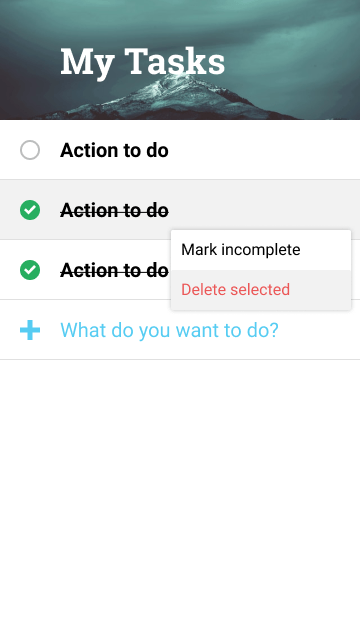
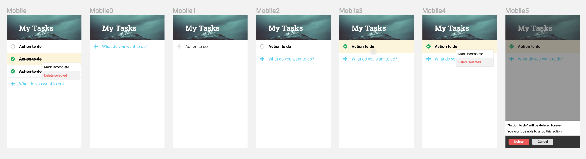

# MyTasks

> A simple todo app with delightful UI

## Design

- [Mockups on Figma](https://www.figma.com/file/fuNjneenEJZgfFRlGCe0aCtp/MyTasks?node-id=9%3A307)
- [Prototype on Figma](https://www.figma.com/proto/fuNjneenEJZgfFRlGCe0aCtp/MyTasks?node-id=9%3A254&scaling=scale-down)

## Features

- Input todo
- Add todo
- Mark todo as complete
- Mark todo as incomplete
- Delete todo
- Cancel delete todo

## License

MIT License
